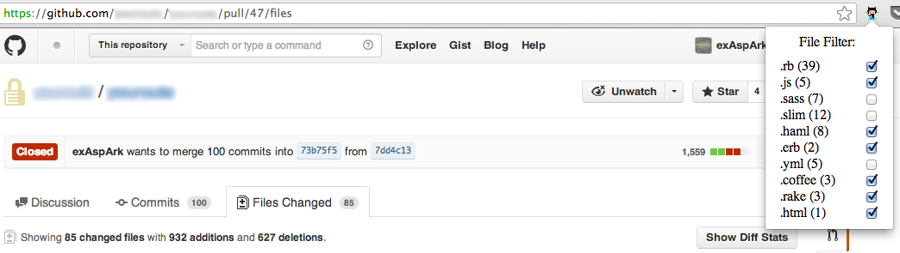

#### GitHub Review File Filter

It is a Chrome extension, that allows you to filter files in Pull Request depending on file extensions. Go to Files Changed tab in Pull Request and click on icon.

#### Features

* Shows all file extensions in Pull Request;
* Allows you to show/hide files by file extension.

#### Getting started

1. Download extension [GitHub Review File Filter](https://dl.dropboxusercontent.com/u/9900414/github-review-file-filter.crx).
2. Go to [chrome://extensions/](chrome://extensions/) and drag extension on that page.

#### TODO

* Show count of files grouped by extension;
* Save previous state of popup on each tab;
* Disable extension if current page is not a GitHub;
* Make it more stylish;
* Add settings (default active file extensions).